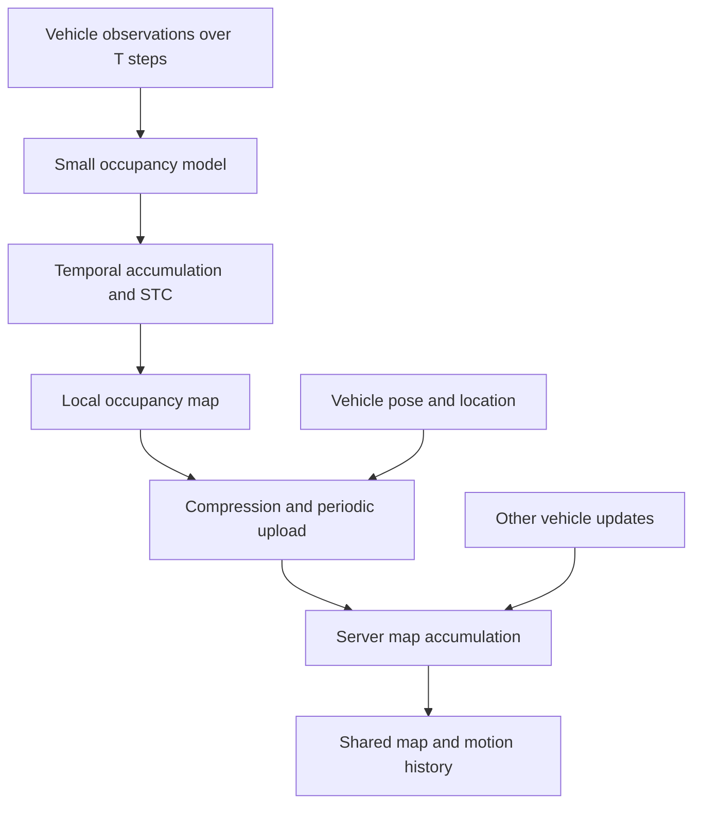

# CoReM: Temporal Occupancy Mapping

[한국어](README_ko.md)

**Status: research concept.** CoReM is the module name supplied by the author. The project proposes collecting a shared 3D map from multiple vehicles with small occupancy models and periodic compressed uploads.

Each vehicle processes a window of T observations, estimates occupancy, accumulates the results, and applies a stage called STC to maintain a local map. The vehicle associates this map with its location and periodically sends a compressed update to a server. The server accumulates updates across vehicles and time, including information about vehicle motion.

## Vehicle and server responsibilities

| Vehicle-side CoReM | Server |
| --- | --- |
| Estimate occupancy from a temporal window | Receive compressed maps and associated location information |
| Accumulate observations into a map around the vehicle | Align updates from different vehicles |
| Apply the proposed STC stage | Accumulate observations across time |
| Compress and periodically transmit updates | Maintain map data and vehicle-motion information |

STC is preserved as the author's original stage label. Its expansion, algorithm, and exact input/output are not specified in the supplied material. GPS is part of the proposed location information; a production coordinate-alignment solution has not been established.

## Intended contribution

The goal is a complete vehicle-to-server mapping workflow with low vehicle-side power and manageable upload volume. Small model size, local aggregation, and compressed updates are design choices toward that goal. No measured power consumption or bandwidth reduction is available.

## Design decisions to resolve

- Timestamp and coordinate conventions for all vehicles.
- Separation of persistent geometry from moving actors, so motion does not smear into a static map.
- Pose uncertainty, duplicate observations, and conflicting updates.
- Compression loss, update interval, data retention, and server fusion policy.
- Measurements of map quality, map freshness, bytes per update, latency, and power.

## Related demonstration

[Multi-agent mapping video](https://youtu.be/AT5Tdq7TjqY) is listed on slide 17 of `포토폴리오.pptx`. It is related earlier work. Its association does not establish implementation of the CoReM design. The remote video was not independently replayed during archive preparation.

## Source

The author's accompanying explanation is the source of this architecture. A separate CoReM/parking deck was not among the three attached files. Slide 2 of `그림 원본.pptx` is not used, following the author's exclusion.
