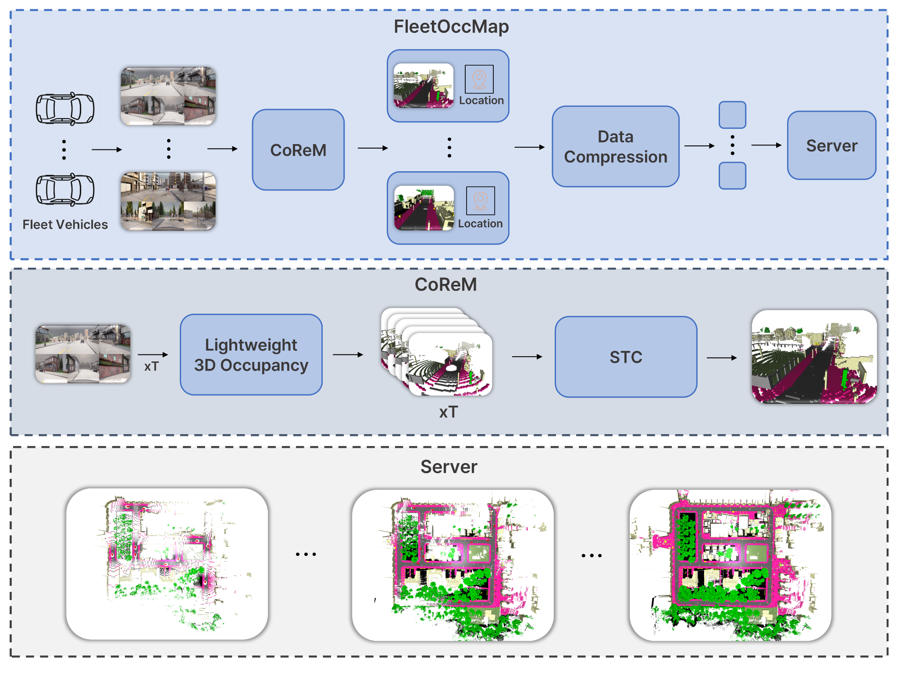
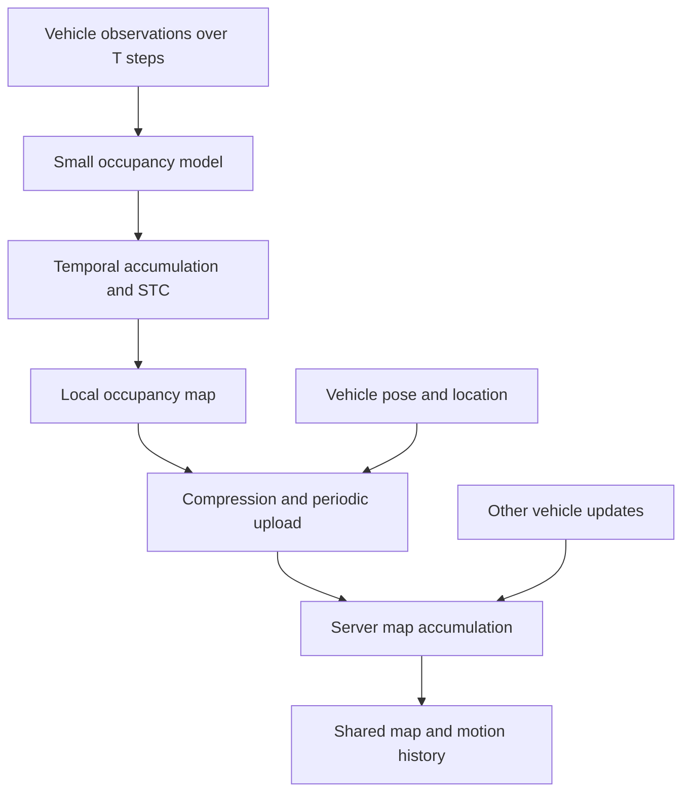

# CoReM: Temporal Occupancy Mapping

[한국어](README_ko.md)

**Status: research concept extending CARLA-based mapping work.** CoReM aims to equip vehicles with a low-power data collection and inference module, obtain observations during driving, and send results from multiple vehicles to a central computer to build a shared 3D map. The intended model would run on a low-power AI accelerator such as DEEPX, allowing a vehicle to participate in driving-data collection by connecting the module.

## Motivation

The idea was to make mapping data collection accessible to vehicles and research environments that lack their own large-scale driving-data collection infrastructure. Rather than requiring identical sensor configurations across vehicles, the system would make use of the available cameras, LiDAR, radar, or combinations of these sensors, adapting collection and processing to each configuration.

A lightweight model on each vehicle would process sensor observations, accumulate useful information, and transmit updates. The central computer would combine data from multiple vehicles to build the map. The ultimate goal was to let vehicles with different sensor configurations participate in a common mapping workflow through a low-power module.

## CARLA and development-kit validation workflow

CARLA was used to obtain driving observations under different sensor configurations, taking advantage of its flexible sensor placement. Building on the earlier CARLA mapping work, the intended device-integration workflow was:

1. Collect driving data in CARLA while varying each vehicle's sensor configuration.
2. Feed and replay the recorded data on a DEEPX-based development kit to emulate incoming sensor streams from a real vehicle.
3. Process the data with a lightweight model on the development kit and transmit the results to the central computer.
4. Combine results and location information from multiple vehicles on the central computer to accumulate a map.

The approach would start with replaying CARLA data as device inputs and later extend to live sensor inputs from real vehicles.

## Proposed map processing

Each vehicle processes a window of T observations, estimates occupancy, accumulates the results, and applies a stage called STC to maintain a local map. The vehicle associates this map with its location and periodically sends a compressed update to a server. The server accumulates updates across vehicles and time, including information about vehicle motion.

## Vehicle and server responsibilities

| Vehicle-side CoReM | Server |
| --- | --- |
| Estimate occupancy from a temporal window | Receive compressed maps and associated location information |
| Accumulate observations into a map around the vehicle | Align updates from different vehicles |
| Apply the proposed STC stage | Accumulate observations across time |
| Compress and periodically transmit updates | Maintain map data and vehicle-motion information |

STC is the temporal processing stage. Its detailed algorithm remains to be defined. GPS provides location information for map updates.

## Intended contribution

The goal is a complete vehicle-to-server mapping workflow with low vehicle-side power and manageable upload volume. Small model size, local aggregation, and compressed updates are design choices toward that goal. No measured power consumption or bandwidth reduction is available.

## Design decisions to resolve

- Timestamp and coordinate conventions for all vehicles.
- Separation of persistent geometry from moving actors, so motion does not smear into a static map.
- Pose uncertainty, duplicate observations, and conflicting updates.
- Compression loss, update interval, data retention, and server fusion policy.
- Measurements of map quality, map freshness, bytes per update, latency, and power.

## Related demonstration

[Multi-agent mapping video](https://youtu.be/AT5Tdq7TjqY): related earlier mapping work.
