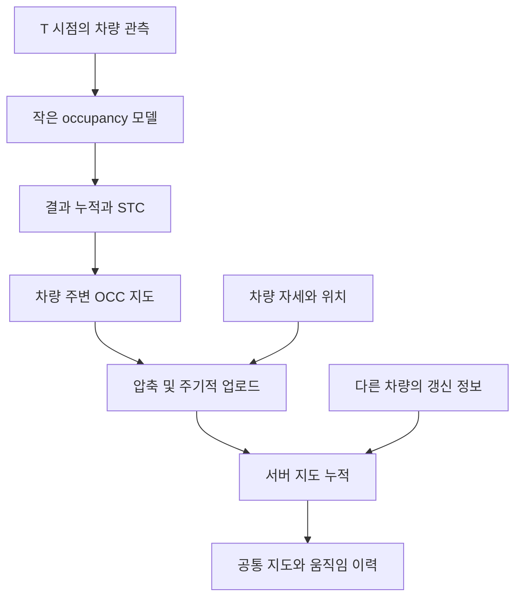

# CoReM: Temporal Occupancy Mapping

[English](README.md)

**상태: CARLA 기반 매핑 작업에서 확장한 연구 구상.** CoReM은 차량에 저전력 데이터 수집·추론 모듈을 장착해 주행 중 관측을 얻고, 여러 차량의 결과를 중앙 컴퓨터로 보내 공통 3D 지도를 축적하는 프로젝트입니다. DEEPX 같은 저전력 AI 가속기에서 실행할 수 있는 경량 모델을 만들어, 모듈을 연결하면 주행 데이터 수집에 참여할 수 있는 구조를 목표로 했습니다.

## 개발 배경

자체적인 대규모 주행 데이터 수집 체계를 갖추기 어려운 차량·연구 환경에서도, 이미 사용할 수 있는 센서를 최대한 활용해 지도 구축에 필요한 관측을 얻고자 했습니다. 모든 차량에 동일한 센서 구성을 요구하기보다 카메라, LiDAR, 레이더 등 차량별로 사용 가능한 센서와 그 조합에 맞춰 데이터를 수집하고 처리하는 방향입니다.

차량에서는 경량 모델로 센서 관측을 처리하고 필요한 정보를 누적·전송하며, 중앙 컴퓨터는 여러 차량에서 받은 데이터를 모아 지도를 구축하는 역할을 맡습니다. 최종 목표는 센서 구성이 다른 차량도 저전력 모듈을 통해 같은 지도 구축 과정에 참여할 수 있게 하는 것입니다.

## CARLA와 개발 키트를 이용한 검증 흐름

CARLA는 차량에 센서를 자유롭게 배치할 수 있어, 다양한 센서 구성을 가진 차량에서 실제 주행처럼 데이터를 얻는 환경으로 활용했습니다. 기존 CARLA 매핑 작업을 바탕으로, 다음과 같은 장치 연동 흐름을 구상했습니다.

1. CARLA에서 차량별 센서 구성을 바꾸며 주행 데이터를 수집합니다.
2. 수집한 데이터를 DEEPX 기반 개발 키트에 입력하고 재생해, 실제 차량에서 센서 데이터가 들어오는 흐름을 모사합니다.
3. 개발 키트에서 경량 모델로 데이터를 처리하고 결과를 중앙 컴퓨터로 송신합니다.
4. 중앙 컴퓨터에서 여러 차량의 결과와 위치 정보를 통합해 지도를 축적합니다.

이 흐름은 CARLA에서 얻은 데이터를 장치 입력으로 재생하는 실험에서 출발해, 이후 실제 차량의 센서 입력으로 확장하려던 방향입니다.

## 지도 처리 구상

차량마다 T 시점의 관측으로 occupancy를 추정하고 결과를 쌓은 뒤, STC 단계를 거쳐 자기 주변의 OCC 지도를 유지합니다. 여기에 위치 정보를 연결하고 일정 시간마다 압축해 서버로 전송합니다. 서버는 여러 차량의 관측과 차량 움직임까지 시간에 따라 모아 관리합니다.

## 역할 분담

| 차량의 CoReM 모듈 | 서버 |
| --- | --- |
| T 시점의 데이터로 occupancy 추정 | 압축 지도와 위치 정보 수신 |
| 자기 주변 관측 누적 | 여러 차량의 관측을 공통 좌표계로 정렬 |
| STC 단계 처리 | 시간에 따른 지도 데이터 축적 |
| 압축 후 일정 주기로 전송 | 지도와 차량 움직임 정보 관리 |

STC는 시계열 처리 단계이며, 상세 알고리즘은 설계 과제입니다. GPS 위치 정보를 지도 갱신에 연결합니다.

## 목표

작은 차량 측 모델, 로컬 누적, 압축 전송을 이용해 저전력으로 차량부터 서버까지 전체 지도 구축 흐름을 만드는 것입니다. 전력이나 통신량 절감 수치는 아직 측정되지 않았습니다.

## 구현 전에 정해야 할 것

- 차량 간 시각과 좌표계 기준
- 정적 구조와 동적 차량의 분리 및 시간 정보 보존
- 위치 오차, 중복 관측, 상충하는 갱신 정보의 처리
- 압축 손실, 업로드 주기, 보관 기간, 서버 융합 정책
- 지도 품질·최신성·전송량·지연시간·전력 측정 방법

## 관련 기존 데모

[멀티 에이전트 매핑 영상](https://youtu.be/AT5Tdq7TjqY): 관련 기존 매핑 작업.
