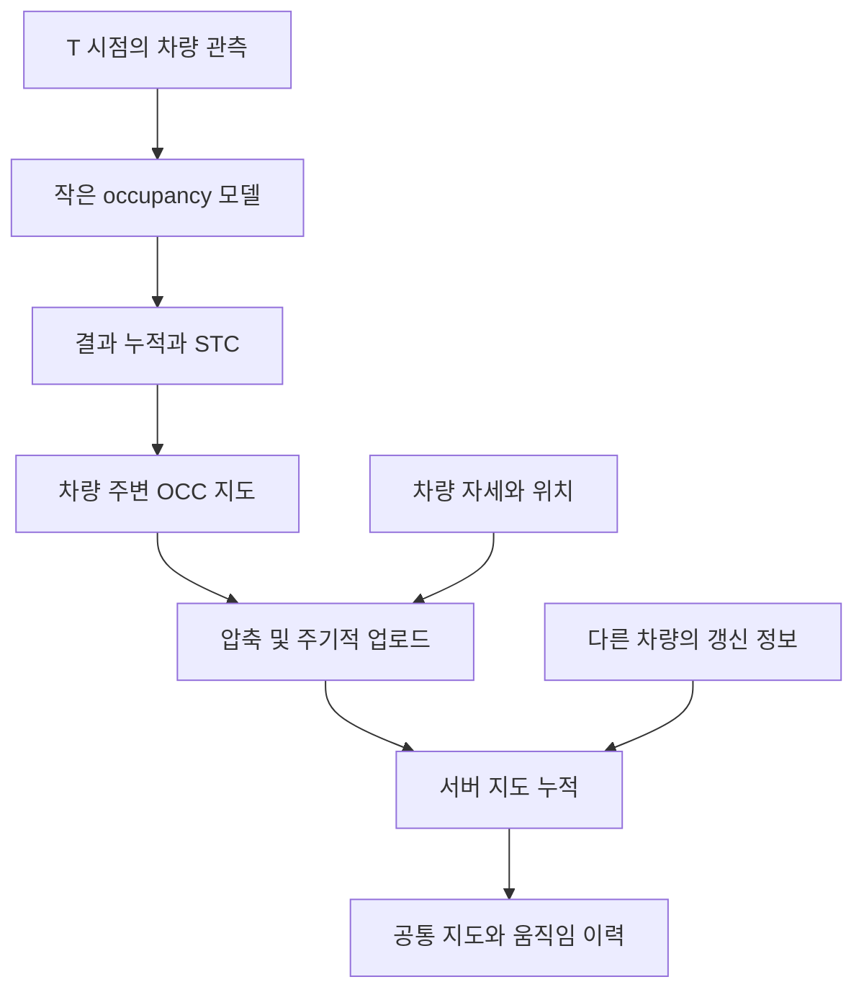

# CoReM: Temporal Occupancy Mapping

[English](README.md)

**상태: 연구 아이디어 단계.** 여러 차량이 작은 occupancy 모델을 실행하고, 각자 만든 지도를 압축해 서버로 보내 공통 3D 지도를 축적하는 구상입니다.

차량마다 T 시점의 관측으로 occupancy를 추정하고 결과를 쌓은 뒤, STC 단계를 거쳐 자기 주변의 OCC 지도를 유지합니다. 여기에 위치 정보를 연결하고 일정 시간마다 압축해 서버로 전송합니다. 서버는 여러 차량의 관측과 차량 움직임까지 시간에 따라 모아 관리합니다.

## 역할 분담

| 차량의 CoReM 모듈 | 서버 |
| --- | --- |
| T 시점의 데이터로 occupancy 추정 | 압축 지도와 위치 정보 수신 |
| 자기 주변 관측 누적 | 여러 차량의 관측을 공통 좌표계로 정렬 |
| STC 단계 처리 | 시간에 따른 지도 데이터 축적 |
| 압축 후 일정 주기로 전송 | 지도와 차량 움직임 정보 관리 |

STC는 시계열 처리 단계이며, 상세 알고리즘은 설계 과제입니다. GPS 위치 정보를 지도 갱신에 연결합니다.

## 목표

작은 차량 측 모델, 로컬 누적, 압축 전송을 이용해 저전력으로 차량부터 서버까지 전체 지도 구축 흐름을 만드는 것입니다. 전력이나 통신량 절감 수치는 아직 측정되지 않았습니다.

## 구현 전에 정해야 할 것

- 차량 간 시각과 좌표계 기준
- 정적 구조와 동적 차량의 분리 및 시간 정보 보존
- 위치 오차, 중복 관측, 상충하는 갱신 정보의 처리
- 압축 손실, 업로드 주기, 보관 기간, 서버 융합 정책
- 지도 품질·최신성·전송량·지연시간·전력 측정 방법

## 관련 기존 데모

[멀티 에이전트 매핑 영상](https://youtu.be/AT5Tdq7TjqY): 관련 기존 매핑 작업.
